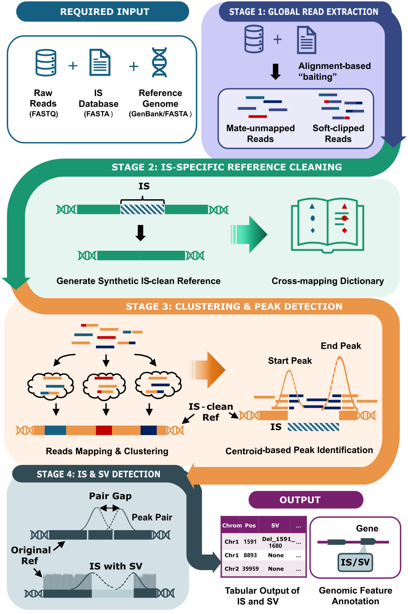

# ISdetector
**ISdetector** is a Python package designed to detect Insertion Sequences (IS) and associated Structural Variations (SVs) using paired-end or single-end Whole Genome Sequencing (WGS) data. It employs a hybrid strategy utilizing both discordant read pairs and split-read signals to identify novel insertion sites, known (reference) sites, and complex deletions.
## Table of Contents
- [Prerequisites](#prerequisites)
- [Installation](#installation)
- [Usage](#usage)
- [Workflow](#workflow)
- [Dataset](#dataset)
- [Arguments](#arguments)
- [Outputs](#outputs)

## Prerequisites
### External Tools
The following tools must be installed and available in your system's `PATH`:
* **BWA** (Burrows-Wheeler Aligner)
* **Samtools**
* **BLASTn** (NCBI BLAST+)
### Python Dependencies
* Python 3.x
* `pysam` (>=0.19.0)
* `biopython` (>=1.80)
* `pandas`
* `numpy` (>=1.18.0)
## Installation
1.  **Clone the repository:**
    ```bash
    git clone https://github.com/carolynzy/isdetector.git
    cd isdetector
    ```
2.  **Install the package and dependencies globally:**
    ```bash
    pip install .
    ```
    *(Note: Using `pip install .` automatically installs the dependencies listed in `setup.py` and registers `isdetector` as a command-line tool.)*
## Usage
Because the tool is installed via `setup.py`, you can run it directly using the `isdetector` command from anywhere.
**For Paired-End Reads:**
```bash
isdetector \
    -1 data/reads_R1.fastq.gz \
    -2 data/reads_R2.fastq.gz \
    -i data/is_elements.fasta \
    -r data/reference_genome.gb \
    -s MySample \
    -o ./results \
    -t 16
```
## Workflow

<p align="center">
    
</p>

## Dataset 
The test data for this pipeline is archived on Zenodo:
**DOI:** [https://doi.org/10.5281/zenodo.18996276](https://doi.org/10.5281/zenodo.18996276)

It could also be downloaded by running: 
```bash
./download_data.sh
```
which will create a folder "data" and download the test data automatically.

## Arguments

```bash
  -h, --help            show this help message and exit
  -i IS_DB, --is_db IS_DB
                        FASTA file of IS sequences (Bait).
  -r REFERENCE, --reference REFERENCE
                        Reference Genome (.fasta or .gb/.gbk).
  -s SAMPLE, --sample SAMPLE
                        Prefix used for output files and log files.
  -o OUTDIR, --outdir OUTDIR
                        Directory for all outputs.
  -t THREADS, --threads THREADS
                        CPU threads (default: 16).
  --debug-fastq         Save Stage 1 extracted reads to file.
  --debug-signal        Save Stage 3 insertion signals to file.
```

Input Reads (Choose One Strategy):
```bash
  -1 FASTQ1, --fastq1 FASTQ1
                        Path to Raw Read 1 (FASTQ/GZ).
  -2 FASTQ2, --fastq2 FASTQ2
                        Path to Raw Read 2 (FASTQ/GZ).
  -f FASTQ, --fastq FASTQ
                        Path to Interleaved Paired-end FASTQ/GZ.
  -u UNPAIRED, --unpaired UNPAIRED
                        Path to Single-End FASTQ/GZ.
```
## Outputs

The pipeline generates a final results file (typically SAMPLE_ISNAME_report.tsv) with the following columns:

| Column |  Description |
| :--- | :--- |
|Chromosome|The genomic scaffold/chromosome where the event was detected.|
| Position | The specific genomic coordinate of the insertion junction. | 
| Category| Classification of the hit: Known, Known(SV), Novel, or Novel(SV).| 
| Orientation| The direction of the IS element relative to the genome (+ or -).| 
| Gap| The distance between the paired peaks (represents deletion size if applicable).| 
| IS_Length| The total length of the IS element detected.| 
| Start/End_Clipped| The count of supporting soft-clipped reads at the start and end junctions.| 
| Discordant_Count| Number of paired-end reads where mates map to different locations (supporting evidence).| 
| SV_Type| Description of associated structural variants (e.g., Deletion_150_300).| 

If a GenBank file is provided for the reference genome, annotation of insertion sites and SVs will also be produced. The annotaion file contains the columns: 

|Column	|Description|
|:---|:---|
|Group_ID|	A unique identifier for a cluster of supporting reads. This allows you to trace multiple peaks or signals back to a single physical insertion event.|
|Position|	The precise genomic coordinate (junction) where the insertion was detected. Usually represents the 5' or 3' end of the element.|
|SV_Type	|The structural category of the event. Currently we only detecte deletions.|
|Annotation_Type	|Describes the genomic region hit by the insertion (e.g., CDS (coding sequence), Intergenic, Promoter, or tRNA).|
|Gene	|The name or locus tag of the gene directly affected by the insertion (e.g., infB, recA, or Locus_0012).|
|Protein|	The name of the protein encoded by the affected gene. If the insertion is intergenic, this field may be empty or labeled as "N/A."|
|Product	|The specific biological function of the protein (e.g., "DNA polymerase III subunit alpha"). This helps in assessing if the IS has disrupted a vital pathway.|

If the --debug-fastq option is setup, a fastq file will be produced with the suffix `_extracted_combined.fq`.

If the --debug-signal option is setup, a txt file containg insertion signals will be saved with the suffix `_ISNAME_signals.tsv`. The debug signal file contains columns: 

|Column	|Description|
|:---|:---|
|Chromosome	|The genomic scaffold where the read was aligned.|
|Cluster_id	|The ID of the peak/cluster this read belongs to. Useful for grouping signals that represent a single junction.|
|Read_id	|The unique name of the FASTQ read. Use this to find the specific read in your original .bam or .fastq files.|
|is_read1	|Boolean (True/False). Indicates if the signal came from the first or second read in a pair (R1 vs R2).|
|Position	|The genomic coordinate where the "clip" starts. This marks the exact breakpoint on the host genome.|
|IS_coordinate	|The position on the IS element that the clipped sequence matched. This helps determine if the insertion is full-length or truncated.|
|Clipped_sequence	|The raw nucleotide sequence that did not match the host genome but did match the IS reference.|
|IS_strand	|The strand of the IS element itself (+ or -) relative to its own reference sequence.|
|Orientation	|The direction of the insertion relative to the host genome.|
|Clip_side	|Indicates if the clip occurred on the Left (5') or Right (3') side of the read.|
